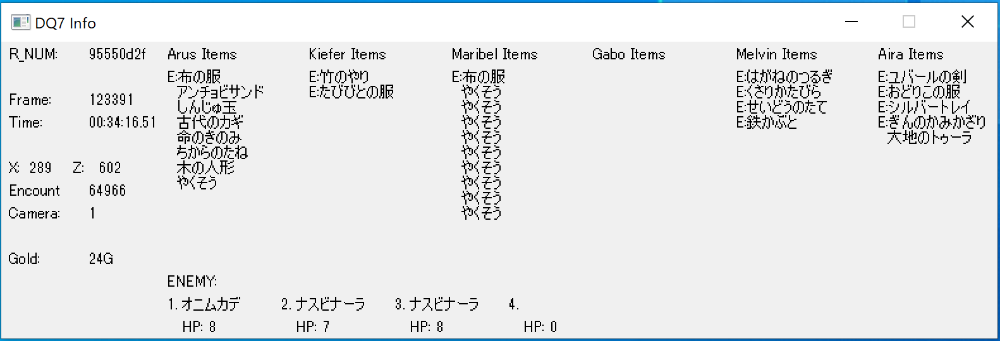

# DQ7_TAS_Lua

DQ7_TASを作成する上で使用するLua Script。
Bizhawkで使うものとAviutlで使うものがあります。

## 動作確認

- Bizhawk 2.5.2
- Aviutl 1.10

## 使用法

### Bizhawk

Bizhawkで使うスクリプト。Tools -> Lua Consoleから使用する。

#### guiInfo.lua



ゲーム上の各パラメーターを別ウィンドウで参照できます。

#### guiInfo_high_dpi.lua

上記、guiInfoの高解像度ディスプレイ用。Windowsで高解像度のモニター等でスケーリングを使っているときにはこちらを使う。
#### record.lua

TASの動画を録画する際に一緒に使うものです。
参考: <https://jackjasonb.com/2021/01/25/dq7_tas_lua/>

```lua
require "utils"

START_FRAME = 0
STOP_FRAME = 91440
```

`START_FRAME`と`STOP_FRAME`に動画化する範囲のフレームを設定します。
このスクリプトで上記フレーム範囲のRAMの情報が`movie.csv`に保存されるので、これを後述のaviutlで読み込ませます。

### Aviutl

Aviutlで使うスクリプト。

#### script/draw_aviutl.obj

このscriptディレクトリごと、Aviutlのrootフォルダにコピーします。
同じscriptディレクトリに`record.lua`で生成した`movie.csv`を配置します。
拡張編集の部分で右クリック->メディアオブジェクトの追加->カスタムオブジェクト->一番左下のドロップダウンボックスからdraw_aviutlを選択するとフレーム数に応じた各値が表示されます。
また、このファイルの文字コードはShift-JIS、改行コードはCRLFに設定して下さい。

#### draw_aviutl.lua

これはAviutlのテキストオブジェクトの文章部分に貼り付けるためのスクリプトです。
Aviutlのテキストオブジェクトは`<? ?>`で囲んだ部分はスクリプトとみなされるので、その中に`draw_aviutl.lua`の中身をコピーします。すると上記のカスタムオブジェクトと同じように表示できます。
ただし、テキストオブジェクトは長いスクリプト行をうまく読み込めない(？)みたいなので注意して下さい。
上記の`draw_aviutl.obj`と違い、こちらはテキストオブジェクトをもとにしているのでフォントや文字色を変更できます。

## 注意

.luaファイル内で日本語を使用する場合は文字コードをShift-JISにして保存する必要があります。
例えばitem.luaやmonster.luaです。
